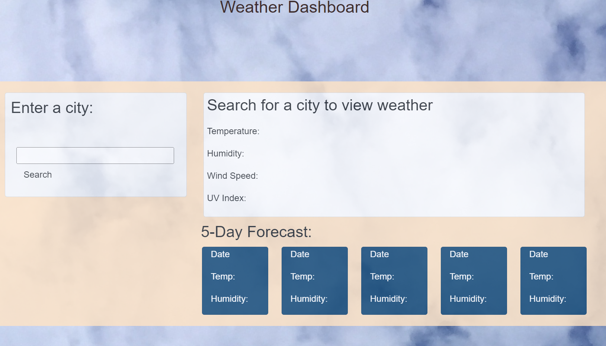
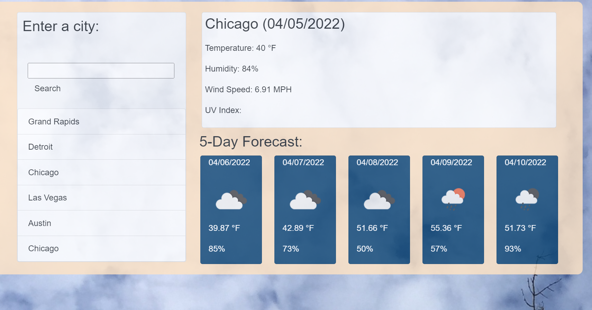

# weather-report

## User Story:
AS A traveler
I WANT to see the weather outlook for multiple cities
SO THAT I can plan a trip accordingly

## Table of Contents
* [Description](#description)
* [Installation](#installation)
* [Usage](#usage)
* [License](#license)
* [Contributor](#contributor)
* [Assets](#assets)
* [Contact](#contact)

## Description
This application helps the users to search for weather information. The user will be able to view daily weather and a 5-day forecast for their city. The user will also be able to click on previous search to get the same information.

Link to deployed app on [GitHub Page](https://chotansharma.github.io/weather-report/)

## Installation 
To run this application, the users need to fork or download the codes.

## Usage 
GIVEN a weather dashboard with form inputs
WHEN I search for a city
THEN I am presented with current and future conditions for that city and that city is added to the search history
WHEN I view current weather conditions for that city
THEN I am presented with the city name, the date, an icon representation of weather conditions, the temperature, the humidity, the wind speed, and the UV index
WHEN I view the UV index
THEN I am presented with a color that indicates whether the conditions are favorable, moderate, or severe
WHEN I view future weather conditions for that city
THEN I am presented with a 5-day forecast that displays the date, an icon representation of weather conditions, the temperature, the wind speed, and the humidity
WHEN I click on a city in the search history
THEN I am again presented with current and future conditions for that city.

## License 
This project is license under MIT

## Contributor
Made with ❤️ by Chotan Sharma

## Assets

## Contact
Please  feel easy to contact me at chotansharma@yahoo.com. For more of my projects, you are aways welcome to my portfolio at https://github.com/ChotanSharma.
